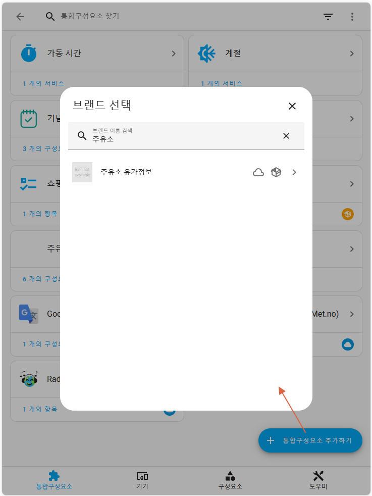
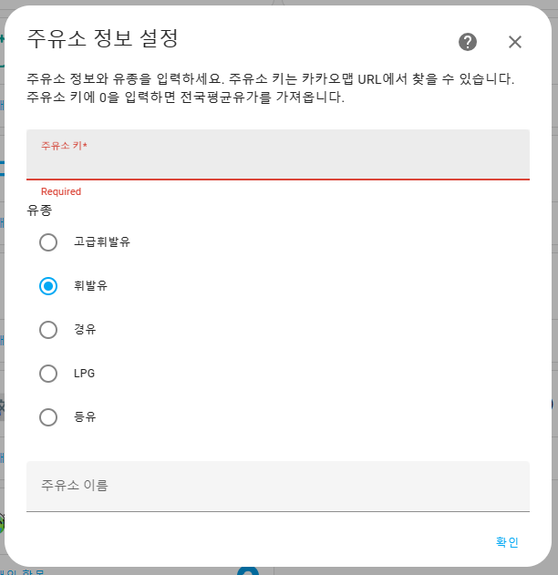

# ⛽ 주유소 유가 정보 센서

🔥 https://github.com/GrecHouse/oil_price 의 통합구성요소 버전입니다.

즐겨찾는 주유소의 유가 정보를 보여줍니다. 전국평균 유가 정보 센서도 자동으로 추가됩니다.\
이 센서는 `오피넷`의 전국유가정보와 `카카오맵`의 상점 정보에서 데이터를 가져옵니다.

 

## Screenshot
\
\

 

## Version history
| Version | Date        |               |
| :-----: | :---------: | ------------- |
| v1.0.0    | 2023.10.24  | 통합구성요소로 재개발 |
| v1.0.1    | 2024.02.02  | '원' 처리 |

 

## Installation

### _My Home Assistant_ HACS로 설치
- 아래 링크를 클릭해서 이동 후 다운로드 버튼을 눌러 설치하세요.
- 다운로드 후 Home Assistant를 재시작합니다.

### HACS 설정을 통한 설치
- HACS > Integrations 메뉴 선택
- 우측 상단 메뉴 버튼 클릭 후 Custom repositories 선택
- Add Custom Repository URL 에 `https://github.com/GrecHouse/gas_station_korea` 입력, \
  Category에 `Integration` 선택 후 ADD
- HACS > Integrations 메뉴에서 우측 하단 + 버튼 누르고 `[KR] Oil Price Sensor` 검색하여 설치
- Home Assistant 를 재시작합니다.

### 직접 설치
- HA 설치 경로 아래 custom_components 에 gas_station_korea 폴더를 모두 그대로 넣어줍니다.
- configuration.yaml 파일에 설정을 추가합니다.
- Home Assistant 를 재시작합니다.

 

## Usage

### 주유소 키 값 얻기
- [카카오맵](https://map.kakao.com/)에서 추가하려는 주유소를 찾습니다.
- 주유소 이름을 눌러 상세 정보 페이지로 이동합니다.\
\
\

- 주소창의 URL 에서 마지막에 숫자로 된 부분을 이용하면 됩니다.\
place.map.kakao.com/`11111111`\
\

 

### configuration
- 설정 > 기기 및 서비스 > 통합구성요소 추가하기
- `주유소` 또는 `유가` 등으로 검색해서 추가하세요.

 

**Configuration variables:**

|입력 항목|값|
|--|--|
|주유소 키| (필수) 카카오맵에서 가져온 숫자 ID 값을 넣어주세요.   `0`을 입력하면 전국평균가격을 가져옵니다. |
|유종| (필수) 기름 종류 선택 |
|주유소 이름| (옵션) 주유소 이름을 넣으면 통합구성요소의 이름으로 지정됩니다. 안 넣으면 ID가 이름이 됩니다. |

 

## 설명
- 이전 `oil_price` 센서와 다르게 한 주유소의 유종별 센서를 각각 생성할 수 있습니다.
- 추가한 주유소들은 `주유소이름-유종` 형태의 센서로 생성됩니다.

- 전국평균 속성 중 `price diff` 는 전일대비 가격 변동 내역입니다.
- `등유` 는 카카오맵 정보에서 제공되지 않습니다. 전국평균가격만 지원됩니다.

 

### 센서 카드 샘플

### mini-graph 카드 샘플

## 버그 또는 문의사항
네이버 카페 [HomeAssistant](https://cafe.naver.com/koreassistant/) `그렉하우스`

